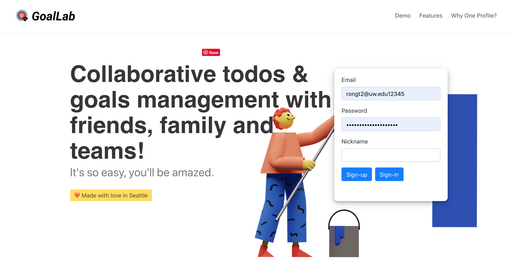
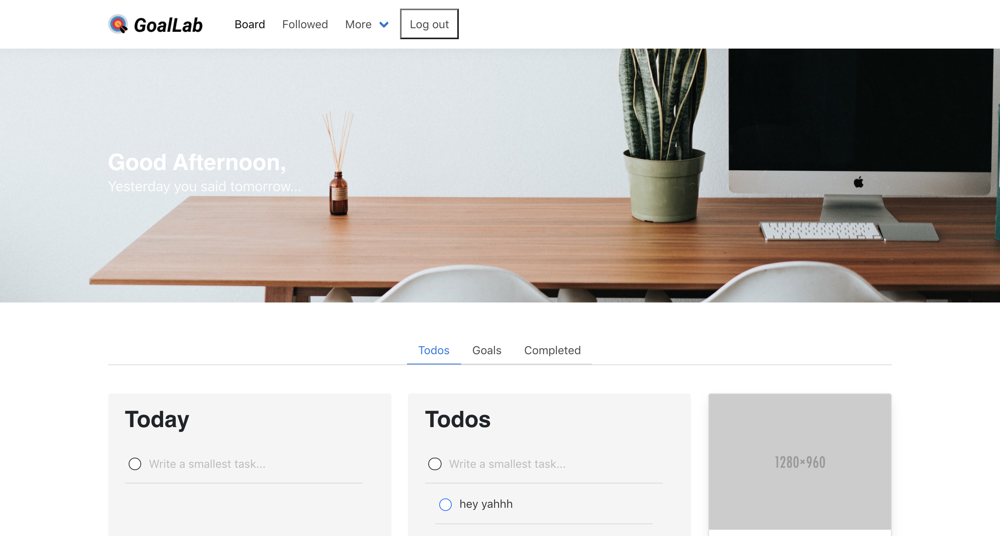
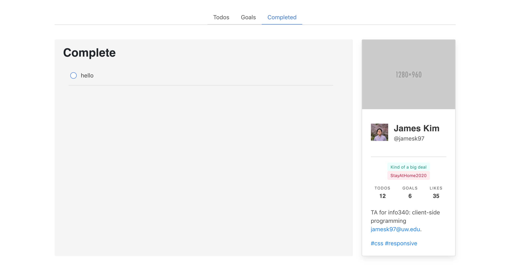

# Project 2: Goal Lab

This a Goal Lab app for people to track their todos and goals. The mainboard is divided into three sections: Todos, Goals, and Complete. Users can add todos and goals to the Today, Todo, and Goal sections. Users can also mark any todo items as completed or incomplete to move them in or out of the Complete section.

## Installation & Usage

You can sign up and log in to the app to view your own todo lists.

You can add new todo items to Today, Todo, or Goal sections by typing you todo into the input box.
  (The inputted todo item can not be empty nor longer than 35 characters.)

By clicking on the circle button in front of the todo/goal item, the todo/goal will be marked as complete.
By clicking on the circle button in front of the completed item, and the completed item can be moved back to the todo list. 

The profile card on the site will show user information and the number of todo items the user has been completed.

## Screenshots

